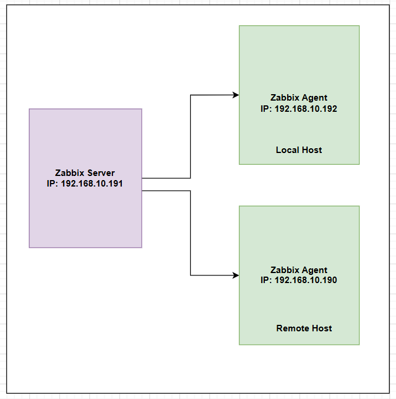

## Local-Remote Files and Directories Count: 

To count the number of files and directories (not files) in both the local and remote directory for comparison, you can use the `find` command on both systems.





### Local File and Directories Count: 

#### On Local Host (192.168.10.192): 

- `find /test -type f` : Finds all files in` /test`.
- `find /test -type d` : Finds all directories (recursively) in `/test`.
- `wc -l` : Counts the number of lines (i.e., the number of files).


_To **count files** in the local directory:_

```
find /test -type f | wc -l

10
```


_To **count directories** in the local directory:_

```
find /test -type d | wc -l

2
```


### Remote File and Directories Count: 

#### SSH On Remote Host (192.168.10.190) from 192.168.10.192: 

- Use `ssh` to count files on the remote directory:


_To **count files** in the remote directory:_

```
ssh root@192.168.10.190 "find /test -type f | wc -l"


root@192.168.10.190's password:

7
```


_To **count directories** in the remote directory:_

```
ssh root@192.168.10.190 "find /test -type d | wc -l"


root@192.168.10.190's password:

2
```


---
---


## Compare File and Directory Counts (Local vs Remote):


### Step-1: Create Home Directory for `zabbix` user on both Local & Remote host:

```
mkdir -p /var/lib/zabbix

chown -R zabbix:zabbix /var/lib/zabbix
```


```
id zabbix
```


```
grep zabbix /etc/passwd


zabbix:x:998:994:Zabbix Monitoring System:/var/lib/zabbix:/sbin/nologin
zabbix:x:994:990:Zabbix Monitoring System:/var/lib/zabbix:/sbin/nologin
```


_Enable user login:_

```
usermod -s /bin/bash zabbix
```


_If Need disable:_
```
usermod -s /sbin/nologin zabbix
```


```
grep zabbix /etc/passwd


zabbix:x:998:994:Zabbix Monitoring System:/var/lib/zabbix:/bin/bash
zabbix:x:994:990:Zabbix Monitoring System:/var/lib/zabbix:/bin/bash
```


### Step-2: Use SSH Password-less Authentication for `zabbix` user: 


#### Login to Local Host (192.168.10.192): 

```
su - zabbix
```


_Create **private and public keys** on Local Host (192.168.10.192):_

```
ssh-keygen
```


```
ll .ssh

-rw------- 1 zabbix zabbix 1679 Dec  9 23:57 id_rsa
-rw-r--r-- 1 zabbix zabbix  394 Dec  9 23:57 id_rsa.pub
```


_Copy **public key** using `ssh-copy-id` to Remote Host (192.168.10.190):_

```
ssh-copy-id zabbix@192.168.10.190
```


_Check on Local Host (192.168.10.192):_

```
ll .ssh

-rw------- 1 zabbix zabbix 1679 Dec  9 23:57 id_rsa
-rw-r--r-- 1 zabbix zabbix  394 Dec  9 23:57 id_rsa.pub
-rw-r--r-- 1 zabbix zabbix  176 Dec  9 23:58 known_hosts
```


_To `ssh` on Remote Host (192.168.10.190):_

```
ssh zabbix@192.168.10.190
```


_Check on Remote Host (192.168.10.190):_

```
ll .ssh/

-rw------- 1 zabbix zabbix 394 Dec 10 05:58 authorized_keys
```


```
exit
```


### Step-3: Verify From Local Host (192.168.10.192) Password-less login: 


```
su - zabbix
```


```
ssh zabbix@192.168.10.190 "find /test -type f | wc -l"

7
```


```
ssh zabbix@192.168.10.190 "find /test -type d | wc -l"

2
```


### Step-4: Create Script: 

- You can automate the comparison in a script. 


#### For File Count:

```
vim /etc/zabbix/my_script/file_count.sh


host192_file_count=$(find /test -type f | wc -l)
#host190_file_count=$(ssh -o StrictHostKeyChecking=no -o UserKnownHostsFile=/dev/null zabbix@192.168.10.191 "find /test -type f | wc -l")
#host190_file_count=$(ssh root@192.168.10.190 "find /test -type f | wc -l")

host190_file_count=$(ssh zabbix@192.168.10.190 "find /test -type f | wc -l")

echo "Host-192 file count: $host192_file_count"
echo "Host-190 file count: $host190_file_count"

if [ -z "$host190_file_count" ]; then
  echo "Error: Unable to retrieve file count from Host-190."
  exit 1
fi


#Subtract counts
difference=$((host192_file_count - host190_file_count))

if [ "$difference" -eq 0 ]; then
  echo "File counts match."
else
  echo "File counts differ by $difference."
fi

```


```
chmod +x file_count.sh
```


```
./file_count.sh


Host-192 file count: 10
Host-190 file count: 7
File counts differ by 3.
```


#### For Directory Count:

```
vim /etc/zabbix/my_script/dir_count.sh


host192_dir_count=$(find /test -type d | wc -l)
#host190_dir_count=$(ssh -o StrictHostKeyChecking=no -o UserKnownHostsFile=/dev/null zabbix@192.168.10.191 "find /test -type f | wc -l")
#host190_dir_count=$(ssh root@192.168.10.190 "find /test -type d | wc -l")

host190_dir_count=$(ssh zabbix@192.168.10.190 "find /test -type d | wc -l")

echo "Host-192 Directory count: $host192_dir_count"
echo "Host-190 Directory count: $host190_dir_count"

if [ -z "$host190_dir_count" ]; then
  echo "Error: Unable to retrieve file count from Host-190."
  exit 1
fi


# Subtract counts
difference=$((host192_dir_count - host190_dir_count))

if [ "$difference" -eq 0 ]; then
  echo "Directory counts match."
else
  echo "Directory counts differ by $difference."
fi

```


```
chmod +x dir_count.sh
```


```
./dir_count.sh


Host-192 Directory count: 2
Host-190 Directory count: 2
Directory counts match.
```


### Step-5: Configure Zabbix Agent: (On Local host: 192.168.10.192)


```
ll /etc/zabbix/my_script

-rwxr-xr-x 1 root root  751 Dec 10 00:10 dir_count.sh
-rwxr-xr-x 1 root root  742 Dec  9 11:53 file_count.sh
```


```
vim /etc/zabbix/zabbix_agent2.conf


### Add lines end of the file: 

UserParameter=minio.file.count,/etc/zabbix/my_script/file_count.sh
UserParameter=minio.dir.count,/etc/zabbix/my_script/dir_count.sh
```


```
systemctl restart zabbix-agent2

systemctl status zabbix-agent2
```


_Check From Local Host (192.168.10.192):_ [Worked]

```
su - zabbix

zabbix_agent2 -t minio.file.count
zabbix_agent2 -t minio.dir.count
```


_Check From Zabbix Server (192.168.10.191):_ [Worked]

```
zabbix_get -s 192.168.10.192 -k minio.file.count
zabbix_get -s 192.168.10.192 -k minio.dir.count
```


### Step-6: Configure Zabbix GUI:

1. Create a Host: 
	- Host name: `File-and-Directory-Count`
	- Visible name: File-and-Directory-Count

	- Templates: `N/A` [-> No Need]
	- Groups: 

	- `Interfaces`:
		- Agent: `192.168.10.192`
		- select: IP
		- port: 10050
		
	- click Add


2. Add a New Items -> click `Items` -> click `Create item`:
	- *Name: `file-count`
	- Type: `Zabbix agent`
	
	- *Key: `minio.file.count`
	
	- Type of information: `Text` 
	
	- *Host interface: `192.168.10.192:10050`
	- *Update interval: `1m` 

	- click Add


3. Again Add a New Items -> click `Items` -> click `Create item`:
	- *Name: `dir-count`
	- Type: `Zabbix agent`
	
	- *Key: `minio.dir.count`
	
	- Type of information: `Text` 
	
	- *Host interface: `192.168.10.192:10050`
	- *Update interval: `1m` 
	
	- click Add


